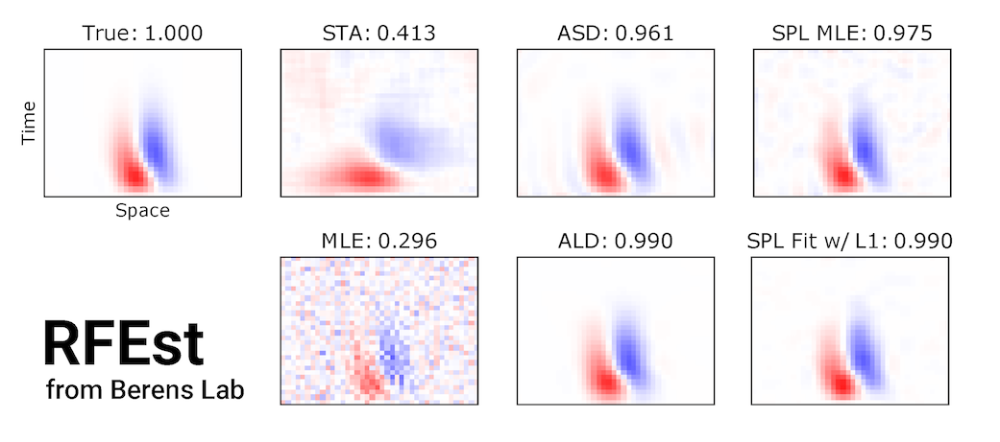

RFEst v2 is a Python3 toolbox for neural receptive field estimation, featuring methods such as spline-based GLMs,
Empirical Bayes with various Gaussian priors, and a few matrix factorization methods.

## Supported Methods

**Spline-based GLMs** [1]

The new GLM module unified both vanilla and spline GLMs.

```python
from rfest import GLM

lnp = GLM(distr='poisson', output_nonlinearity='softplus')

# add training data
lnp.add_design_matrix(X_train, dims=[25, ], df=[8, ], smooth='cr', name='stimulus')  # use spline for stimulus filter
lnp.add_design_matrix(y_train, dims=[20, ], df=[8, ], smooth='cr', shift=1,
                      name='history')  # use spline for history filter

# add validation data
lnp.add_design_matrix(X_dev, name='stimulus')  # basis will automatically apply to dev set
lnp.add_design_matrix(y_dev, name='history')

# intialize model parameters
lnp.initialize(num_subunits=1, dt=dt, method='random', random_seed=2046)

# fit model
lnp.fit(y={'train': y_train, 'dev': y_dev},
        num_iters=1000, verbose=100, step_size=0.1, beta=0.01)
```

**Evidence Optimization**

* Ridge Regression
* Automatic Relevance Determination (ARD) [2]
* Automatic Smoothness Determination (ASD) [3]
* Automatic Locality Determination (ALD) [4]

```python
from rfest import ASD

asd = ASD(X, y, dims=[5, 20, 15])  # nT, nX, nY
p0 = [1., 1., 2., 2., 2.]  # sig, rho, 𝛿t, 𝛿y, 𝛿x
asd.fit(p0=p0, num_iters=300)
```

**Matrix Factorization**

A few matrix factorization methods have been implemented as a submodule (`MF`).

```python
from rfest.MF import KMeans, semiNMF
```

For more information, see [here](https://github.com/berenslab/RFEst/blob/master/rfest/MF/README.md).

## Installation

RFEst uses [JAX](https://github.com/google/jax) for automatic differentiation and JIT compilation to GPU/CPU, so you
need to install JAX first.

To install CPU-only version for **Linux and macOS**, simply clone this repo into a local directory and install
via `pip`:

```bash
git clone https://github.com/berenslab/RFEst
pip install -e RFEst
```

To enable GPU support on **Linux**, you need to consult
the [JAX install guide](https://github.com/google/jax#pip-installation). For reference purpose, I copied the relevant
steps here, but please always check the JAX README page for up-to-date information.

```bash
# install jaxlib
PYTHON_VERSION=cp37  # alternatives: cp36, cp37, cp38
CUDA_VERSION=cuda100  # alternatives: cuda100, cuda101, cuda102, cuda110
PLATFORM=manylinux2010_x86_64  # alternatives: manylinux2010_x86_64
BASE_URL='https://storage.googleapis.com/jax-releases'
pip install --upgrade $BASE_URL/$CUDA_VERSION/jaxlib-0.1.50-$PYTHON_VERSION-none-$PLATFORM.whl

pip install --upgrade jax  # install jax
```

### A Note For Windows Users

JAX has no native Windows support yet, but can be installed on **CPU via the Windows Subsystem for Linux** (Windows 10
only, and make sure that the pip version is the latest `pip install --upgrade pip`).

## Dependencies

    numpy
    scipy
    sklearn
    matplotlib
    jax
    jaxlib

## Tutorial

Tutorial notebooks can be found
here: [https://github.com/huangziwei/notebooks_RFEst](https://github.com/huangziwei/notebooks_RFEst)

## Reference

[1] Huang, Z., Ran, Y., Oesterle, J., Euler, T., & Berens, P. (2021). Estimating smooth and sparse neural receptive
fields with a flexible spline basis. Neurons, Behavior, Data Analysis, and Theory, 5(3),
1–30. https://doi.org/10.51628/001c.27578

[2] MacKay, D. J. (1994). Bayesian nonlinear modeling for the prediction competition. ASHRAE transactions, 100(2),
1053-1062.

[3] Sahani, M., & Linden, J. F. (2003). Evidence optimization techniques for estimating stimulus-response functions. In
Advances in neural information processing systems (pp. 317-324).

[4] Park, M., & Pillow, J. W. (2011). Receptive field inference with localized priors. PLoS computational biology, 7(10)
, e1002219.

