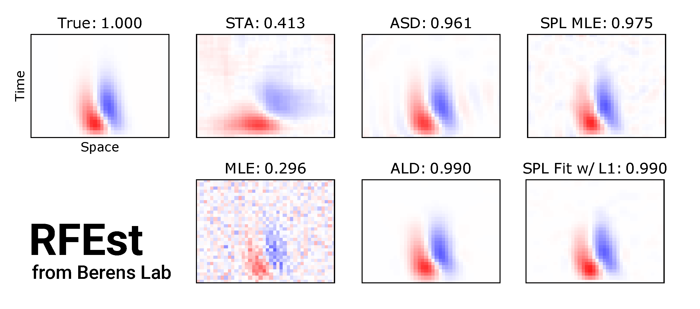

# RFEst

A Python 3 tool for neural receptive field (RF) estimation.



## Installation

RFEst uses [JAX](https://github.com/google/jax) for automatic differentiation and JIT compilation to GPU/CPU, so you need to install JAX first. 

### For Linux and MacOS users

To install CPU-only version, simply clone this repo into local directory and then run the following steps:

```bash
git clone https://github.com/berenslab/RFEst
pip install -r RFEst/requirements.txt
pip install -e RFEst
```

To enable GPU support on **Linux**, you need to consult the [JAX installation guide](https://github.com/google/jax#pip-installation). For reference purpose, I copied the relevant steps here, but please always check the JAX README page for up-to-date information.

```bash
# install jaxlib
PYTHON_VERSION=cp37  # alternatives: cp27, cp35, cp36, cp37
CUDA_VERSION=cuda92  # alternatives: cuda90, cuda92, cuda100, cuda101
PLATFORM=linux_x86_64  # alternatives: linux_x86_64
BASE_URL='https://storage.googleapis.com/jax-releases'
pip install --upgrade $BASE_URL/$CUDA_VERSION/jaxlib-0.1.30-$PYTHON_VERSION-none-$PLATFORM.whl

pip install --upgrade jax  # install jax
```

### For Windows Users

JAX doen't support Windows yet, so RFEst also won't be able to be installed on Windows. However, if you are running Windows 10, you can install JAX within the [Windows Subsystem for Linux](https://docs.microsoft.com/en-us/windows/wsl/install-win10) (but only the relatively outdated versions of JAX==0.1.43 and jaxlib==0.1.23, sadly). To install, run:

```bash
git clone https://github.com/berenslab/RFEst 
pip install -r RFEst/requirements_win.txt # use pip3 if alias to pip wasn't added to ~/.bashrc or ~/.zshrc
pip install -e RFEst
```
    
## Supported Methods and Usage

**Spline-based Methods** [1]

`splineLG` and `splineLNLN` use *natural cubic regression splines* to approximate spatio-temporal RFs. 

Given a stimulus design matrix (X) and the corresponding response (y), an optimized RF is calculated with respect to the dimension of the RF `dims=(nT, nY, nX)` :

```python
from rfest import splineLG

spl = splineLG(X, y, dims=(5, 20, 15)，df_splines=9) 
spl.fit(num_iters=500, alpha=1, lambd=0.025, verbal=100)
```

**Evidence Optimization**

* Automatic Smoothness Determination (ASD) [2]
* Automatic Locality Determination (ALD) [3]

```python
from rfest import ASD

asd = ASD(X, y, dims=(5, 20, 15))
asd.fit(initial_params=[1., 1., 2., 2., 2.], num_iters=300)
```

## Dependencies

    numpy
    scipy
    sklearn
    matplotlib
    jax
    jaxlib
    patsy
    
## Data

The accompanying data for example notebooks are from:

Ran, Y., Huang, Z., Baden, T., Baayen, H., Berens, P., Franke, K., & Euler, T. (2019). Type-specific dendritic integration in mouse retinal ganglion cells. bioRxiv, 753335.
    

## Reference

[1] Hunag, Z., &  Berens, P. (in preparation). Efficient receptive field inference using cubic regression splines.

[2] Sahani, M., & Linden, J. F. (2003). Evidence optimization techniques for estimating stimulus-response functions. In Advances in neural information processing systems (pp. 317-324).

[3] Park, M., & Pillow, J. W. (2011). Receptive field inference with localized priors. PLoS computational biology, 7(10), e1002219.
